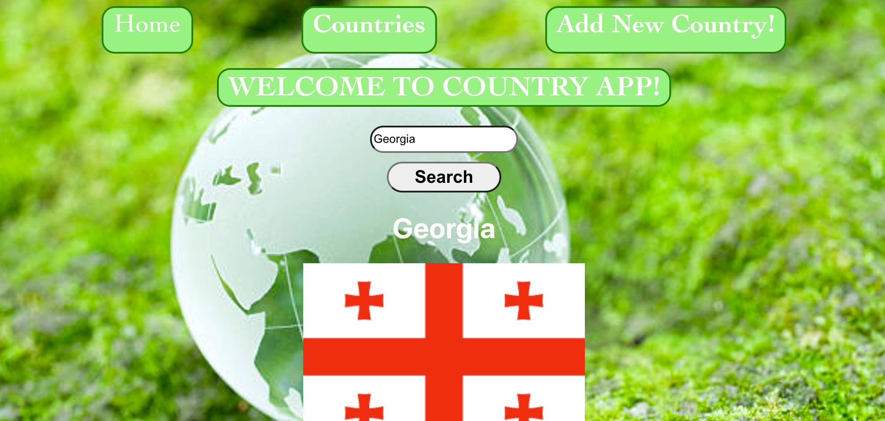
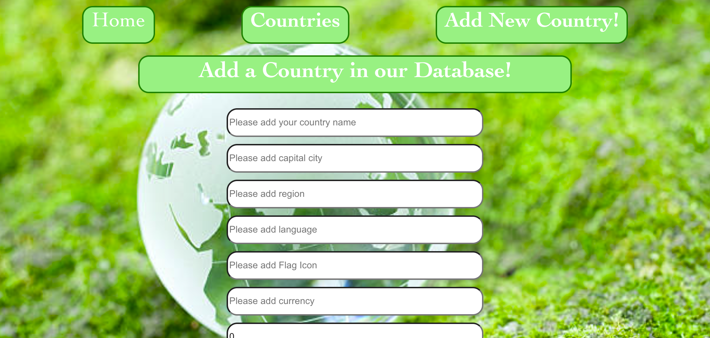

# Country App

This is a React application for displaying information about countries. It allows users to view a list of countries, search for specific countries, add new countries to the database, edit existing country information, and delete countries.

## Installation

1. Clone the repository:

   ```bash
   git clone https://github.com/your-username/country-app.git


2. Install dependencies:

cd country-app

npm install

## Usage

Start the development server:

npm start
pen http://localhost:3000 to view the app in your browser.

Features:
- View a list of countries.
- Search for countries by name.
- Add new countries to the database.
- Edit existing country information.
- Delete countries from the database.


# Technologies Used

- React
- React Router
- Axios
- Node.js
- Express
- MongoDB
- Mongoose


/Search for countries by name./


/Edit existing country information./
/Delete countries from the database./


/Add new countries to the database./



License
This project is licensed under the MIT License - see the LICENSE file for details.


